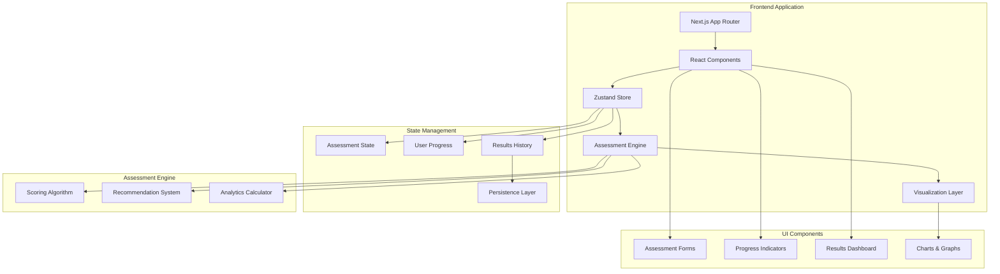
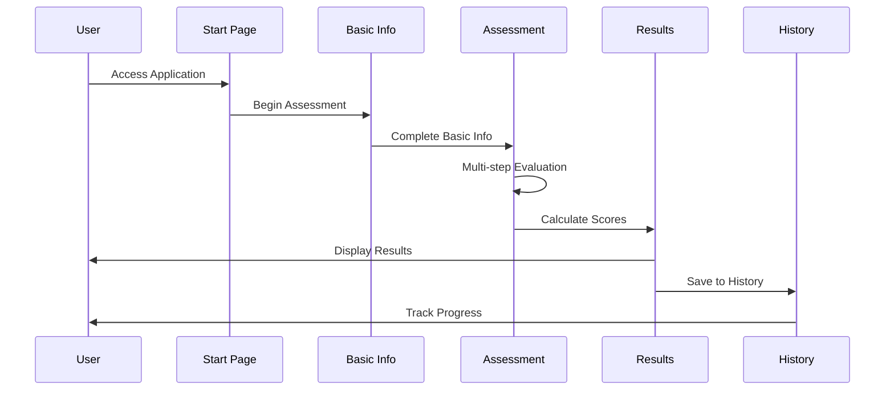

<div align="center"><a name="readme-top"></a>

[](#)

# 🚀 Job Value Assessment Tool<br/><h3>Professional Career Decision Support Platform</h3>

A comprehensive web application that helps professionals quantitatively evaluate their current job positions through a scientific assessment framework.<br/>
Make data-driven career decisions by analyzing job satisfaction across multiple dimensions with advanced analytics and personalized insights.<br/>
One-click **FREE** assessment of your career satisfaction and job value.

[Live Demo][demo-link] · [Documentation][docs-link] · [Report Issues][github-issues-link] · [Request Features][github-issues-link]

<br/>

[][demo-link]

<br/>

<!-- SHIELD GROUP -->

[![][github-release-shield]][github-release-link]
[![][vercel-shield]][vercel-link]
[![][github-action-test-shield]][github-action-test-link]<br/>
[![][github-contributors-shield]][github-contributors-link]
[![][github-forks-shield]][github-forks-link]
[![][github-stars-shield]][github-stars-link]
[![][github-issues-shield]][github-issues-link]
[![][github-license-shield]][github-license-link]<br>
[![][sponsor-shield]][sponsor-link]

**Share This Project**

[![][share-x-shield]][share-x-link]
[![][share-telegram-shield]][share-telegram-link]
[![][share-whatsapp-shield]][share-whatsapp-link]
[![][share-reddit-shield]][share-reddit-link]
[![][share-linkedin-shield]][share-linkedin-link]

<sup>🌟 Transforming career decision-making through quantitative assessment. Built for modern professionals seeking clarity.</sup>

[](https://star-history.com/#ChanMeng666/job-valuation&Date)

## 📸 Application Screenshots

> [!TIP]
> Experience the complete assessment journey from start to personalized insights.

<div align="center">
  
  <p><em>Assessment Start - Welcome & Introduction</em></p>
</div>

<div align="center">
  
  
  <p><em>Multi-step Assessment - Basic Info Collection & Detailed Evaluation</em></p>
</div>

<div align="center">
  
  <p><em>Results Dashboard - Comprehensive Analysis & Insights</em></p>
</div>

<details>
<summary><kbd>📱 More Screenshots</kbd></summary>

<div align="center">
  
  <p><em>Version 1.0 - Initial Design</em></p>
</div>

<div align="center">
  
  <p><em>Detailed Results with Recommendations</em></p>
</div>

</details>

## 🎬 Demo Video

> [!NOTE]
> Watch the complete assessment process in action.

<div align="center">

https://github.com/user-attachments/assets/a350e2cf-daf8-4d58-9cdd-1403e89d10fb

*Complete assessment workflow demonstration*

</div>

**Tech Stack Badges:**

<div align="center">

 
 
 
 
 
 

</div>

</div>

> [!IMPORTANT]
> This professional assessment tool provides scientifically-backed job evaluation across 10 key dimensions. Features multi-step assessment flow, weighted scoring system, interactive visualizations, and personalized career recommendations.

<details>
<summary><kbd>📑 Table of Contents</kbd></summary>

#### TOC

- [🚀 Job Value Assessment ToolProfessional Career Decision Support Platform](#-job-value-assessment-toolprofessional-career-decision-support-platform)
  - [📸 Application Screenshots](#-application-screenshots)
  - [🎬 Demo Video](#-demo-video)
      - [TOC](#toc)
  - [🌟 Introduction](#-introduction)
  - [✨ Key Features](#-key-features)
    - [`1` Comprehensive Assessment Framework](#1-comprehensive-assessment-framework)
    - [`2` Scientific Scoring System](#2-scientific-scoring-system)
    - [`*` Additional Features](#-additional-features)
  - [🛠️ Tech Stack](#️-tech-stack)
  - [🏗️ Architecture](#️-architecture)
    - [System Architecture](#system-architecture)
    - [Assessment Flow](#assessment-flow)
    - [Component Structure](#component-structure)
  - [⚡️ Performance](#️-performance)
    - [Performance Metrics](#performance-metrics)
  - [🚀 Getting Started](#-getting-started)
    - [Prerequisites](#prerequisites)
    - [Quick Installation](#quick-installation)
    - [Environment Setup](#environment-setup)
    - [Development Mode](#development-mode)
  - [🛳 Deployment](#-deployment)
    - [`A` Cloud Deployment](#a-cloud-deployment)
    - [`B` Docker Deployment](#b-docker-deployment)
    - [`C` Environment Variables](#c-environment-variables)
  - [📖 Usage Guide](#-usage-guide)
    - [Basic Usage](#basic-usage)
    - [Assessment Process](#assessment-process)
    - [Understanding Results](#understanding-results)
  - [🔌 Integrations](#-integrations)
  - [⌨️ Development](#️-development)
    - [Local Development](#local-development)
    - [Adding Features](#adding-features)
    - [Testing](#testing)
  - [🤝 Contributing](#-contributing)
  - [📄 License](#-license)
  - [👥 Team](#-team)
  - [🙋‍♀️ Author](#️-author)

<br/>

</details>

## 🌟 Introduction

We are passionate about empowering professionals to make informed career decisions through data-driven insights. This comprehensive job assessment tool combines scientific evaluation methodologies with modern web technologies to provide actionable career guidance.

Whether you're considering a career change, negotiating with your current employer, or simply seeking to understand your job satisfaction levels, this platform offers objective analysis across multiple dimensions of work life.

> [!NOTE]
> - Node.js >= 18.0 required for development
> - Modern web browser required for optimal experience
> - All assessments are processed locally for privacy
> - Results can be saved for future comparison

| [![][demo-shield-badge]][demo-link]   | No registration required! Start your assessment immediately.                           |
| :------------------------------------ | :--------------------------------------------------------------------------------------------- |
| [![][github-shield-badge]][github-stars-link] | Join our community! Star us for updates and contribute to the project. |

> [!TIP]
> **⭐ Star us** to receive all release notifications and support the project!

<details>
  <summary><kbd>⭐ Star History</kbd></summary>
  <picture>
    <source media="(prefers-color-scheme: dark)" srcset="https://api.star-history.com/svg?repos=ChanMeng666%2Fjob-valuation&theme=dark&type=Date">
    
  </picture>
</details>

## ✨ Key Features

### `1` [Comprehensive Assessment Framework][docs-assessment]

Experience a holistic job evaluation system that analyzes your position across 10 critical dimensions. Our multi-category framework examines Input (time investment, work intensity), Output (compensation, growth potential), and Compatibility (skill match, value alignment) factors.

<div align="center">
  
  <p><em>Multi-dimensional Assessment Interface</em></p>
</div>

**Assessment Categories:**
- 💼 **Input Factors**: Time investment, work intensity, stress levels
- 💰 **Output Factors**: Compensation, growth opportunities, job security
- 🎯 **Compatibility**: Skill utilization, value alignment, work environment

[![][back-to-top]](#readme-top)

### `2` [Scientific Scoring System][docs-scoring]

Advanced weighted scoring algorithm that processes your responses through a sophisticated calculation engine. Each dimension carries specific weights based on career research, ensuring accurate and meaningful results.

<div align="center">
  
  <p><em>Visual Analytics Dashboard</em></p>
</div>

**Key Metrics:**
- **Balance Score**: Equilibrium between effort and rewards
- **Match Score**: Alignment with your profile and preferences
- **Overall Rating**: Comprehensive job satisfaction index

[![][back-to-top]](#readme-top)

### `*` Additional Features

Beyond core assessment capabilities, the platform includes:

- [x] 📊 **Interactive Visualizations**: Radar charts and bar graphs for data insights
- [x] 💡 **Personalized Recommendations**: AI-generated improvement suggestions
- [x] 📈 **Progress Tracking**: Save and compare assessments over time
- [x] 🌐 **Multi-language Support**: Comprehensive internationalization
- [x] 📱 **Responsive Design**: Optimized for all devices
- [x] 🔒 **Privacy-First**: All data processed locally
- [x] ⚡ **Real-time Updates**: Instant score calculation and feedback
- [x] 📋 **Export Options**: Download results for future reference

> ✨ More features are continuously being added based on user feedback.

<div align="right">

[![][back-to-top]](#readme-top)

</div>

## 🛠️ Tech Stack

<div align="center">
  <table>
    <tr>
      <td align="center" width="96">
        
        <br>Next.js 15
      </td>
      <td align="center" width="96">
        
        <br>React 18
      </td>
      <td align="center" width="96">
        
        <br>TypeScript 5
      </td>
      <td align="center" width="96">
        
        <br>Tailwind CSS
      </td>
      <td align="center" width="96">
        
        <br>Zod Validation
      </td>
      <td align="center" width="96">
        
        <br>Zustand
      </td>
      <td align="center" width="96">
        
        <br>Recharts
      </td>
    </tr>
  </table>
</div>

**Frontend Stack:**
- **Framework**: Next.js 15 with App Router architecture
- **Language**: TypeScript for comprehensive type safety
- **Styling**: Tailwind CSS with shadcn/ui components
- **State Management**: Zustand with persistence middleware
- **Form Handling**: React Hook Form with Zod validation
- **Data Visualization**: Recharts for interactive charts

**UI/UX Components:**
- **Design System**: shadcn/ui component library
- **Icons**: Lucide React icon set
- **Animations**: Tailwind CSS animations
- **Responsive**: Mobile-first responsive design
- **Accessibility**: WCAG compliant components

**Development Tools:**
- **Build System**: Next.js optimized bundling
- **Code Quality**: ESLint + Prettier configuration
- **Type Checking**: Strict TypeScript compilation
- **Hot Reload**: Fast refresh development experience

> [!TIP]
> Each technology was selected for optimal developer experience, performance, and maintainability in modern web development.

## 🏗️ Architecture

### System Architecture

> [!TIP]
> Client-side processing ensures complete privacy while maintaining high performance through optimized React components and state management.



### Assessment Flow



### Component Structure

```
src/
├── app/                          # Next.js App Router
│   ├── assessment/              # Assessment pages
│   │   ├── start/              # Welcome & introduction
│   │   ├── basic/              # Basic information
│   │   ├── evaluation/         # Main assessment
│   │   └── result/             # Results display
│   ├── globals.css             # Global styles
│   └── layout.tsx              # Root layout
├── components/                  # Reusable components
│   ├── ui/                     # shadcn/ui components
│   ├── forms/                  # Form components
│   ├── AssessmentForm.tsx      # Main assessment logic
│   └── AssessmentResult.tsx    # Results visualization
├── store/                      # State management
│   ├── assessment.ts           # Assessment store
│   └── store.ts               # Store configuration
├── types/                      # TypeScript definitions
│   └── assessment.ts           # Assessment types
└── lib/                       # Utility functions
    └── utils.ts               # Helper functions
```

## ⚡️ Performance

> [!NOTE]
> Optimized for speed and efficiency with client-side processing and modern web technologies.

### Performance Metrics

- ⚡ **Loading Speed**: < 2s first contentful paint
- 🚀 **Interactive Time**: < 1s time to interactive
- 💨 **Assessment Processing**: Real-time score calculation
- 📱 **Mobile Performance**: 95+ Lighthouse score
- 🔄 **State Updates**: Instant UI response

**Performance Optimizations:**
- 🎯 **Code Splitting**: Automatic route-based splitting
- 📦 **Bundle Optimization**: Tree-shaking and minification
- 🖼️ **Image Optimization**: Next.js Image component
- 🔄 **Caching Strategy**: Efficient state persistence

## 🚀 Getting Started

### Prerequisites

> [!IMPORTANT]
> Ensure you have the following installed:

- Node.js 18.0+ ([Download](https://nodejs.org/))
- npm/yarn/pnpm package manager
- Git ([Download](https://git-scm.com/))

### Quick Installation

**1. Clone Repository**

```bash
git clone https://github.com/ChanMeng666/job-valuation.git
cd job-valuation
```

**2. Install Dependencies**

```bash
# Using npm
npm install

# Using yarn
yarn install

# Using pnpm (recommended)
pnpm install
```

**3. Start Development**

```bash
npm run dev
```

🎉 **Success!** Open [http://localhost:3000](http://localhost:3000) to view the application.

### Environment Setup

The application runs entirely client-side and doesn't require additional environment variables for basic functionality.

### Development Mode

```bash
# Start with hot reload
npm run dev

# Build for production
npm run build

# Start production server
npm run start

# Run linting
npm run lint
```

## 🛳 Deployment

### `A` Cloud Deployment

**Vercel (Recommended)**

[](https://vercel.com/new/clone?repository-url=https%3A%2F%2Fgithub.com%2FChanMeng666%2Fjob-valuation)

**Manual Deployment:**

```bash
# Install Vercel CLI
npm i -g vercel

# Deploy
vercel --prod
```

**Other Platforms:**

<div align="center">

|           Deploy with Netlify            |                     Deploy with Railway                      |
| :-------------------------------------: | :---------------------------------------------------------: |
| [![][deploy-netlify-button]][deploy-netlify-link] | [![][deploy-railway-button]][deploy-railway-link] |

</div>

### `B` Docker Deployment

```bash
# Build Docker image
docker build -t job-valuation .

# Run container
docker run -p 3000:3000 job-valuation
```

### `C` Environment Variables

> [!NOTE]
> This application runs entirely client-side and doesn't require server-side environment variables.

| Variable | Description | Required | Default |
|----------|-------------|----------|---------|
| `NODE_ENV` | Environment mode | 🔶 | `development` |
| `NEXT_PUBLIC_APP_URL` | Application URL | 🔶 | `http://localhost:3000` |

> [!NOTE]
> 🔶 Optional

## 📖 Usage Guide

### Basic Usage

**Getting Started:**

1. **Access Application** at [demo link][demo-link]
2. **Click "Start Assessment"** to begin evaluation
3. **Complete Basic Information** about your job and background
4. **Evaluate Each Dimension** across multiple categories
5. **Review Results** with detailed analytics and recommendations

### Assessment Process

**Step 1: Basic Information**
- Personal details (age, education, experience)
- Job information (industry, role, level, type)

**Step 2: Multi-dimensional Evaluation**
- **Input Category**: Time investment, work intensity, stress levels
- **Output Category**: Compensation, growth opportunities, job security
- **Compatibility**: Skill match, value alignment, work environment

**Step 3: Results Analysis**
- Comprehensive scoring across all dimensions
- Visual analytics with radar and bar charts
- Personalized improvement recommendations

### Understanding Results

**Score Interpretation:**
- **90-100**: Excellent job match
- **80-89**: Good job with minor improvements needed
- **70-79**: Average job with areas for enhancement
- **60-69**: Below average, consider changes
- **Below 60**: Poor match, significant changes recommended

## 🔌 Integrations

Currently focused on client-side functionality with potential for future integrations:

| Category | Service | Status | Planned |
|----------|---------|--------|---------|
| **Analytics** | Google Analytics | 🔶 Planned | ✅ |
| **Export** | PDF Generation | 🔶 Planned | ✅ |
| **Sharing** | Social Media | 🔶 Planned | ✅ |
| **Storage** | Cloud Backup | 🔶 Planned | ✅ |

## ⌨️ Development

### Local Development

**Setup Development Environment:**

```bash
# Clone repository
git clone https://github.com/ChanMeng666/job-valuation.git
cd job-valuation

# Install dependencies
npm install

# Start development server
npm run dev
```

**Development Scripts:**

```bash
# Development
npm run dev          # Start dev server with hot reload
npm run build        # Production build
npm run start        # Start production server
npm run lint         # ESLint code analysis
```

### Adding Features

**1. Create Feature Branch:**

```bash
git checkout -b feature/new-feature
```

**2. Development Guidelines:**

- ✅ Follow TypeScript best practices
- ✅ Maintain component reusability
- ✅ Update type definitions
- ✅ Test thoroughly across devices
- ✅ Follow existing code patterns

**3. Assessment Logic Extensions:**

```typescript
// Add new dimension to DIMENSIONS array
export const DIMENSIONS: Dimension[] = [
  // ... existing dimensions
  {
    id: "new_dimension",
    title: "New Assessment Area",
    weight: 1.0,
    category: "付出" | "回报" | "匹配度",
    description: "Description of new dimension",
    metrics: [
      // Define metrics with scoring levels
    ]
  }
];
```

### Testing

**Manual Testing Checklist:**
- [ ] Complete assessment flow works
- [ ] All form validations function
- [ ] Charts render correctly
- [ ] Mobile responsive design
- [ ] State persistence works
- [ ] Score calculations accurate

## 🤝 Contributing

We welcome contributions! Here's how you can help improve this project:

**Contribution Areas:**
- 🐛 **Bug Reports**: Report issues with detailed reproduction steps
- 💡 **Feature Requests**: Suggest new assessment dimensions or UI improvements
- 📚 **Documentation**: Help improve user guides and technical docs
- 🌐 **Internationalization**: Add support for new languages
- 🎨 **UI/UX**: Enhance design and user experience

**Development Process:**
1. Fork the repository
2. Create a feature branch
3. Make your changes
4. Test thoroughly
5. Submit a pull request

[![][pr-welcome-shield]][pr-welcome-link]

## 📄 License

This project is licensed under the Apache-2.0 License - see the [LICENSE](LICENSE) file for details.

**Open Source Benefits:**
- ✅ Commercial use allowed
- ✅ Modification allowed
- ✅ Distribution allowed
- ✅ Private use allowed

## 👥 Team

<div align="center">
  <table>
    <tr>
      <td align="center">
        <a href="https://github.com/ChanMeng666">
          
          <br />
          <sub><b>Chan Meng</b></sub>
        </a>
        <br />
        <small>Creator & Lead Developer</small>
      </td>
    </tr>
  </table>
</div>

## 🙋‍♀️ Author

**Chan Meng**
-  LinkedIn: [chanmeng666](https://www.linkedin.com/in/chanmeng666/)
-  GitHub: [ChanMeng666](https://github.com/ChanMeng666)
-  Email: [chanmeng.dev@gmail.com](mailto:chanmeng.dev@gmail.com)
-  Website: [chanmeng.live](https://2d-portfolio-eta.vercel.app/)

---

<div align="center">
<strong>🚀 Empowering Career Decisions Through Data 🌟</strong>
<br/>
<em>Making job satisfaction measurable and actionable</em>
<br/><br/>

⭐ **Star us on GitHub** • 📖 **Read the Documentation** • 🐛 **Report Issues** • 💡 **Request Features** • 🤝 **Contribute**

<br/><br/>

**Made with ❤️ by [Chan Meng](https://github.com/ChanMeng666)**


</div>

---

<!-- LINK DEFINITIONS -->

[back-to-top]: https://img.shields.io/badge/-BACK_TO_TOP-151515?style=flat-square

<!-- Project Links -->
[demo-link]: https://job-valuation.vercel.app/assessment/start
[docs-link]: https://github.com/ChanMeng666/job-valuation#readme
[docs-assessment]: https://github.com/ChanMeng666/job-valuation#-comprehensive-assessment-framework
[docs-scoring]: https://github.com/ChanMeng666/job-valuation#-scientific-scoring-system

<!-- GitHub Links -->
[github-issues-link]: https://github.com/ChanMeng666/job-valuation/issues
[github-stars-link]: https://github.com/ChanMeng666/job-valuation/stargazers
[github-forks-link]: https://github.com/ChanMeng666/job-valuation/forks
[github-contributors-link]: https://github.com/ChanMeng666/job-valuation/contributors
[github-release-link]: https://github.com/ChanMeng666/job-valuation/releases
[pr-welcome-link]: https://github.com/ChanMeng666/job-valuation/pulls
[github-license-link]: https://github.com/ChanMeng666/job-valuation/blob/main/LICENSE

<!-- Community Links -->
[sponsor-link]: https://github.com/sponsors/ChanMeng666

<!-- Shield Badges -->
[github-release-shield]: https://img.shields.io/github/v/release/ChanMeng666/job-valuation?color=369eff&labelColor=black&logo=github&style=flat-square
[vercel-shield]: https://img.shields.io/badge/vercel-online-55b467?labelColor=black&logo=vercel&style=flat-square
[vercel-link]: https://job-valuation.vercel.app
[github-action-test-shield]: https://img.shields.io/github/actions/workflow/status/ChanMeng666/job-valuation/test.yml?label=test&labelColor=black&logo=githubactions&logoColor=white&style=flat-square
[github-action-test-link]: https://github.com/ChanMeng666/job-valuation/actions
[github-contributors-shield]: https://img.shields.io/github/contributors/ChanMeng666/job-valuation?color=c4f042&labelColor=black&style=flat-square
[github-forks-shield]: https://img.shields.io/github/forks/ChanMeng666/job-valuation?color=8ae8ff&labelColor=black&style=flat-square
[github-stars-shield]: https://img.shields.io/github/stars/ChanMeng666/job-valuation?color=ffcb47&labelColor=black&style=flat-square
[github-issues-shield]: https://img.shields.io/github/issues/ChanMeng666/job-valuation?color=ff80eb&labelColor=black&style=flat-square
[github-license-shield]: https://img.shields.io/badge/license-Apache--2.0-white?labelColor=black&style=flat-square
[sponsor-shield]: https://img.shields.io/badge/-Sponsor%20Project-f04f88?logo=opencollective&logoColor=white&style=flat-square
[pr-welcome-shield]: https://img.shields.io/badge/🤝_PRs_welcome-%E2%86%92-ffcb47?labelColor=black&style=for-the-badge

<!-- Badge Variants -->
[demo-shield-badge]: https://img.shields.io/badge/TRY%20DEMO-ONLINE-55b467?labelColor=black&logo=vercel&style=for-the-badge
[github-shield-badge]: https://img.shields.io/badge/GITHUB-STAR%20US-ffcb47?labelColor=black&logo=github&style=for-the-badge

<!-- Social Share Links -->
[share-x-link]: https://x.com/intent/tweet?hashtags=career,assessment,webdev&text=Check%20out%20this%20job%20assessment%20tool&url=https%3A%2F%2Fgithub.com%2FChanMeng666%2Fjob-valuation
[share-telegram-link]: https://t.me/share/url?text=Job%20Assessment%20Tool&url=https%3A%2F%2Fgithub.com%2FChanMeng666%2Fjob-valuation
[share-whatsapp-link]: https://api.whatsapp.com/send?text=Check%20out%20this%20job%20assessment%20tool%20https%3A%2F%2Fgithub.com%2FChanMeng666%2Fjob-valuation
[share-reddit-link]: https://www.reddit.com/submit?title=Job%20Assessment%20Tool&url=https%3A%2F%2Fgithub.com%2FChanMeng666%2Fjob-valuation
[share-linkedin-link]: https://linkedin.com/sharing/share-offsite/?url=https://github.com/ChanMeng666/job-valuation

[share-x-shield]: https://img.shields.io/badge/-share%20on%20x-black?labelColor=black&logo=x&logoColor=white&style=flat-square
[share-telegram-shield]: https://img.shields.io/badge/-share%20on%20telegram-black?labelColor=black&logo=telegram&logoColor=white&style=flat-square
[share-whatsapp-shield]: https://img.shields.io/badge/-share%20on%20whatsapp-black?labelColor=black&logo=whatsapp&logoColor=white&style=flat-square
[share-reddit-shield]: https://img.shields.io/badge/-share%20on%20reddit-black?labelColor=black&logo=reddit&logoColor=white&style=flat-square
[share-linkedin-shield]: https://img.shields.io/badge/-share%20on%20linkedin-black?labelColor=black&logo=linkedin&logoColor=white&style=flat-square

<!-- Deployment Links -->
[deploy-netlify-link]: https://app.netlify.com/start/deploy?repository=https://github.com/ChanMeng666/job-valuation
[deploy-railway-link]: https://railway.app/new/template?template=https://github.com/ChanMeng666/job-valuation

[deploy-netlify-button]: https://www.netlify.com/img/deploy/button.svg
[deploy-railway-button]: https://railway.app/button.svg

